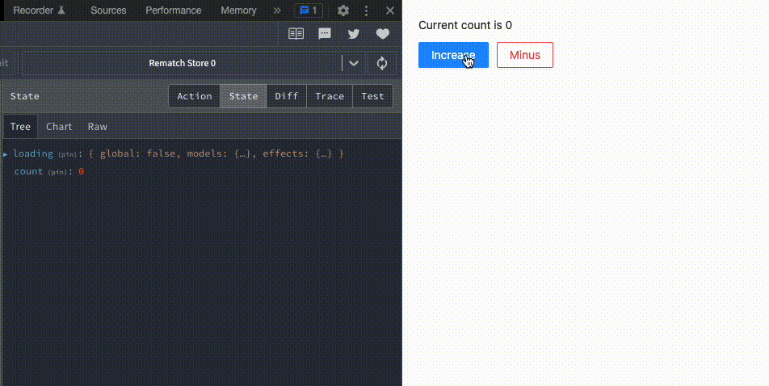

# rematch-example-count

Example demonstrating usage of Rematch redux in React.



## How to Run

```bash
$ git clone https://github.com/kinfei/rematch-example-count.git
$ cd rematch-example-count
$ yarn install
$ yarn start
```

## How to Build

```bash
$ yarn build
```

## How to Run Production Build

```bash
$ yarn serve
```
